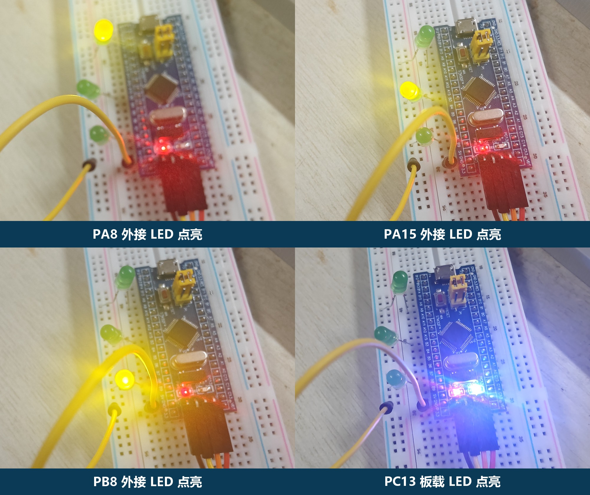

# STM32F103C8T6 Blue Pill 裸寄存器实现四灯流水灯（PA8、PA15、PB8、PC13）

本文记录一个不使用 HAL/LL 的 STM32F103C8T6 GPIO 实验：三只外接 LED 接在 PA8、PA15、PB8，再把 Blue Pill 板载 PC13 LED 加入流水序列，每隔 1 秒切换一次。

## 一、实验效果

流水顺序：

```text
PA8 → PA15 → PB8 → PC13 → PA8 → ……
```

PA8、PA15、PB8 默认采用高电平点亮，PC13 板载 LED 因原理图接在 3.3 V 与 PC13 之间，所以是低电平点亮。

实物已经完成 CMSIS-DAP 烧录和 Flash 回读校验，四个点亮阶段如下：



连续运行视频：[流水灯运行视频（MP4）](assets/流水灯运行视频.mp4)。照片中的外接 LED 为临时无电阻演示接线，本文只确认功能现象，不把该接法认定为电气安全或长期可靠。

## 二、容易踩坑的地方

1. Blue Pill 侧边排针是 PA15，不是 PA13。PA13、PA14 是 SWDIO、SWCLK，不能在调试阶段当普通 GPIO 使用。
2. PA15 上电默认是 JTAG 的 JTDI，需要把 AFIO_MAPR 的 SWJ_CFG 配成 `010`，关闭 JTAG 但保留 SWD。
3. PC13 低电平点亮，不能直接照搬外接 LED 的高电平逻辑。
4. 外接 LED 应串联 330 Ω～1 kΩ 限流电阻。题目没写不代表电气上可以省略。
5. 延时使用 SysTick 1 ms 时基，不使用受优化等级影响的空循环。

## 三、寄存器配置

```c
RCC_APB2ENR |= (1UL << 0) | (1UL << 2) |
                 (1UL << 3) | (1UL << 4);

AFIO_MAPR = (AFIO_MAPR & ~(0x7UL << 24)) | (0x2UL << 24);
```

四个引脚均配置为 2 MHz 通用推挽输出，即每个 CRH 字段写 `0b0010`：

| 引脚 | 寄存器字段 |
|---|---|
| PA8 | GPIOA_CRH[3:0] |
| PA15 | GPIOA_CRH[31:28] |
| PB8 | GPIOB_CRH[3:0] |
| PC13 | GPIOC_CRH[23:20] |

## 四、统一处理高低有效

```c
typedef struct {
    uint32_t port_base;
    uint8_t pin;
    uint8_t active_low;
} led_t;

static const led_t leds[] = {
    {0x40010800UL, 8U,  0U},
    {0x40010800UL, 15U, 0U},
    {0x40010C00UL, 8U,  0U},
    {0x40011000UL, 13U, 1U}
};
```

通过 `active_low` 描述极性，点灯函数可同时支持外接灯与 PC13。

## 五、1 秒定时

系统明确选择内部 HSI 8 MHz：

```text
8,000,000 / 1,000 = 8,000
SysTick LOAD = 8,000 - 1 = 7,999
```

SysTick 每毫秒进入一次中断，主循环等待 1000 个毫秒计数即可。

## 六、工程内容

项目提供：

- 纯寄存器 `main.c`；
- Cortex-M3 启动文件和 STM32F103C8T6 链接脚本；
- PowerShell 与 Makefile 构建方式；
- 三灯版和加入 PC13 的四灯版 HEX/BIN；
- Markdown/PDF 实验报告。
- 四阶段实物照片与连续运行视频。

仓库地址：`发布后填写`

## 七、参考资料

- [ST RM0008](https://www.st.com/resource/en/reference_manual/cd00171190-stm32f101-103-105-107-stm32f100-series-armbased-32bit-mcus-stmicroelectronics.pdf)
- [Blue Pill 原理图](https://github.com/STM32-base/STM32-base.github.io/blob/master/assets/pdf/boards/original-schematic-STM32F103C8T6-Blue_Pill.pdf)
- [ST CMSIS Device F1](https://github.com/STMicroelectronics/cmsis-device-f1)

完整代码与更详细的寄存器地址表见项目中的《实验报告.md》。
