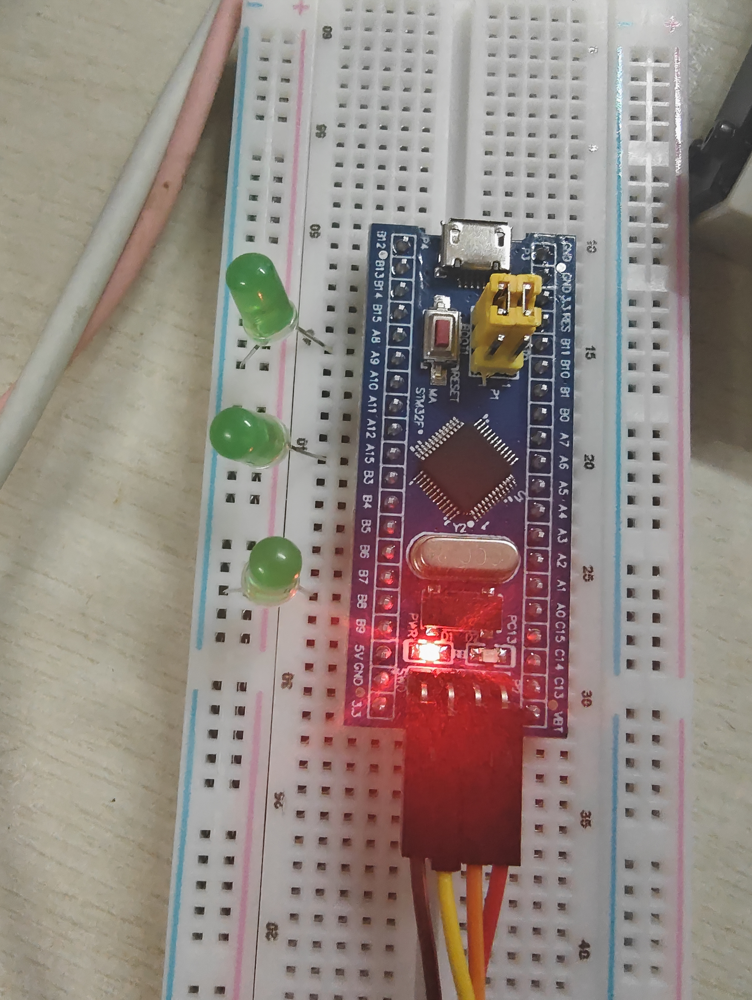

# STM32F103C8T6 Blue Pill 裸寄存器流水灯实验报告

实验日期：2026 年 9 月 20 日

开发板常用英文名是 **Blue Pill**，不是“Blue Bill”。这次程序已经烧进板子，PA8、PA15、PB8 和板载 PC13 都拍到了点亮状态，视频里也能看到灯在连续切换。程序设置的是 1 秒间隔，实际没有用示波器测量。

## 1. 实验目的

1. 了解 STM32F103C8T6 最小系统核心板的电源、时钟、复位、启动、SWD 和板载 LED 电路。
2. 掌握 STM32F1 系列存储器映射和 GPIO 寄存器的地址计算方法。
3. 不使用 HAL、LL 和标准外设库，直接通过 C 语言访问 RCC、AFIO、GPIO 和 SysTick 寄存器。
4. 使用 PA8、PA15、PB8 控制三只外接 LED，每隔 1 秒轮流点亮。
5. 把低电平有效的板载 PC13 LED 加入流水序列，形成四灯流水。
6. 学习使用 Git 保存版本，并把项目提交到 GitHub 或 Gitee。

## 2. 实验器材与软件

| 类别 | 名称及数量 |
|---|---|
| 主控 | STM32F103C8T6 Blue Pill 最小系统板 1 块 |
| 调试器 | Horco CMSIS-DAP 调试器 1 个 |
| 搭接器材 | 面包板 1 块、杜邦线若干 |
| 发光器件 | 外接 LED 3 只，板载 PC13 LED 1 只 |
| 保护器件 | 每只外接 LED 建议串联 330 Ω～1 kΩ 电阻 1 只 |
| 开发工具 | Arm GNU Toolchain 14.2、PowerShell、Git 2.54 |
| 烧录工具 | pyOCD + Keil STM32F1 Device Family Pack |

接线照片中可以看到 Blue Pill、CMSIS-DAP/SWD 线和三只外接 LED。三个 LED 的外壳颜色不会影响程序运行。



## 3. STM32F103C8T6 最小系统板原理

### 3.1 核心器件

STM32F103C8T6 采用 Arm Cortex-M3 内核，常见标称资源为 64 KB Flash、20 KB SRAM，最高系统时钟 72 MHz。Blue Pill 最小系统板通常还包括：

- 3.3 V 稳压与电源指示灯；
- 8 MHz 高速外部晶振及负载电容；
- 32.768 kHz 低速晶振（不同板卡可能装配不同）；
- NRST 复位按键与复位网络；
- BOOT0、BOOT1 启动方式选择；
- USB 接口；
- SWDIO、SWCLK、3.3 V、GND 四针调试接口；
- 从 3.3 V 经 LED 和电阻连接到 PC13 的板载灯。

为了不受不同 Blue Pill 板上外部晶振装配情况的影响，程序启动后直接使用片内 HSI 8 MHz。

### 3.2 板载 PC13 LED

Blue Pill 原理图中，板载 LED 的电流路径为：

```text
3.3 V  ── LED ── 限流电阻 ── PC13
```

因此：

- PC13 输出低电平时，电流从 3.3 V 流向 PC13，LED 点亮；
- PC13 输出高电平时，两端电位接近，LED 熄灭；
- 板载 PC13 是“低电平有效”，与常见的“GPIO 高电平驱动外接 LED”正好相反。

PC13～PC15 属于备份电源域相关引脚，驱动能力受限。本实验只驱动板载小电流 LED，并把 GPIO 配置为 2 MHz 推挽输出，不用于大电流负载。

## 4. 实物引脚与接线

### 4.1 照片引脚辨认

照片一侧排针的顺序包含 `... PA12、PA15、PB3 ...`。丝印较小，`PA15` 容易被误读为 `PA13`。标准 Blue Pill 的 PA13、PA14 用于 SWDIO、SWCLK，位于四针下载接口，不应在开发阶段改作普通 GPIO。

本实验按照片使用：

| 流水顺序 | 控制引脚 | 端口 | 配置寄存器 | 备注 |
|---:|---|---|---|---|
| 1 | PA8 | GPIOA | GPIOA_CRH | 外接 LED 1 |
| 2 | PA15 | GPIOA | GPIOA_CRH | 外接 LED 2；先关闭 JTAG，保留 SWD |
| 3 | PB8 | GPIOB | GPIOB_CRH | 外接 LED 3 |
| 4 | PC13 | GPIOC | GPIOC_CRH | 板载 LED，低电平有效 |

### 4.2 推荐接线

外接三灯默认采用高电平点亮：

| GPIO | 连接方式 |
|---|---|
| PA8 | PA8 → 限流电阻 → LED 正极；LED 负极 → GND |
| PA15 | PA15 → 限流电阻 → LED 正极；LED 负极 → GND |
| PB8 | PB8 → 限流电阻 → LED 正极；LED 负极 → GND |
| PC13 | 使用板上已有 LED，不需外接 |

限流电阻虽然不是程序要求，但是真实接线时很重要。LED 直接接在 GPIO 和 GND 之间，电流可能过大，容易损坏 LED 或 MCU 引脚。正式接线应给每只灯串 330 Ω～1 kΩ 电阻。照片里是为了先看效果的临时接法，没有加电阻，不建议长时间保持这样通电。

若外接 LED 实际连接为 `3.3 V → 电阻 → LED → GPIO`，应将编译宏 `EXTERNAL_LEDS_ACTIVE_LOW` 改为 1；否则三只外接灯的亮灭逻辑会反相。

## 5. 寄存器地址和详细参数

### 5.1 外设基地址

STM32 采用统一编址，外设寄存器可以通过 `volatile uint32_t *` 访问。

| 模块 | 基地址 | 所属总线 |
|---|---:|---|
| AFIO | `0x40010000` | APB2 |
| GPIOA | `0x40010800` | APB2 |
| GPIOB | `0x40010C00` | APB2 |
| GPIOC | `0x40011000` | APB2 |
| RCC | `0x40021000` | AHB/APB 桥控制 |
| SysTick | `0xE000E010` | Cortex-M3 内核外设 |

### 5.2 RCC 和 AFIO

| 寄存器 | 地址 | 使用位 | 本实验值及作用 |
|---|---:|---|---|
| RCC_CR | `0x40021000` | HSION bit0、HSIRDY bit1 | 置 HSION，等待 HSIRDY，启用 HSI 8 MHz |
| RCC_CFGR | `0x40021004` | SW bits1:0、SWS bits3:2 | SW=`00`，选择 HSI；等待 SWS=`00` |
| RCC_APB2ENR | `0x40021018` | AFIOEN bit0 | 置 1，使能 AFIO |
| RCC_APB2ENR | `0x40021018` | IOPAEN bit2 | 置 1，使能 GPIOA |
| RCC_APB2ENR | `0x40021018` | IOPBEN bit3 | 置 1，使能 GPIOB |
| RCC_APB2ENR | `0x40021018` | IOPCEN bit4 | 置 1，使能 GPIOC |
| AFIO_MAPR | `0x40010004` | SWJ_CFG bits26:24 | 写 `010`：关闭 JTAG-DP，保留 SW-DP，释放 PA15 |

程序对 RCC_APB2ENR 使用按位或操作：

```c
RCC_APB2ENR |= (1UL << 0) | (1UL << 2) |
                 (1UL << 3) | (1UL << 4);
```

这样只修改所需时钟位，不会误清除其他外设的使能状态。

### 5.3 GPIO 寄存器地址

| 端口 | CRL | CRH | IDR | ODR | BSRR | BRR | LCKR |
|---|---:|---:|---:|---:|---:|---:|---:|
| GPIOA | `0x40010800` | `0x40010804` | `0x40010808` | `0x4001080C` | `0x40010810` | `0x40010814` | `0x40010818` |
| GPIOB | `0x40010C00` | `0x40010C04` | `0x40010C08` | `0x40010C0C` | `0x40010C10` | `0x40010C14` | `0x40010C18` |
| GPIOC | `0x40011000` | `0x40011004` | `0x40011008` | `0x4001100C` | `0x40011010` | `0x40011014` | `0x40011018` |

- CRL 配置 0～7 号引脚，每个引脚占 4 位；本实验没有使用 CRL 引脚，但列出其地址以完整说明端口寄存器。
- CRH 配置 8～15 号引脚，每个引脚同样占 4 位。
- IDR 读取引脚实际输入电平。
- ODR 保存输出数据锁存值。
- BSRR 低 16 位写 1 可原子置高，高 16 位写 1 可原子置低。
- BRR 低 16 位写 1 可原子置低。
- LCKR 可锁定端口配置，本实验不使用。

### 5.4 CRH 参数计算

STM32F1 的每个 GPIO 配置字段为：

```text
CNF[1:0] MODE[1:0]
   00       10      = 0b0010 = 0x2
```

其中 CNF=`00` 表示通用推挽输出，MODE=`10` 表示最大输出速度 2 MHz。

| 引脚 | CRH 字段 | 移位量 | 清零掩码 | 写入值 |
|---|---|---:|---:|---:|
| PA8 | GPIOA_CRH[3:0] | 0 | `~(0xF << 0)` | `0x2 << 0` |
| PA15 | GPIOA_CRH[31:28] | 28 | `~(0xF << 28)` | `0x2 << 28` |
| PB8 | GPIOB_CRH[3:0] | 0 | `~(0xF << 0)` | `0x2 << 0` |
| PC13 | GPIOC_CRH[23:20] | 20 | `~(0xF << 20)` | `0x2 << 20` |

配置时先清除该引脚原有 4 位，再写入 `0x2`，不会覆盖同端口其他引脚的状态。

### 5.5 输出电平参数

| 引脚 | 置高操作 | 置低操作 | 点亮电平 |
|---|---|---|---|
| PA8 | GPIOA_BSRR=`1<<8` | GPIOA_BRR=`1<<8` | 默认高 |
| PA15 | GPIOA_BSRR=`1<<15` | GPIOA_BRR=`1<<15` | 默认高 |
| PB8 | GPIOB_BSRR=`1<<8` | GPIOB_BRR=`1<<8` | 默认高 |
| PC13 | GPIOC_BSRR=`1<<13` | GPIOC_BRR=`1<<13` | 低 |

程序使用 BSRR/BRR，而不是对 ODR 做“读-修改-写”，可避免中断或其他代码同时修改同一端口时产生竞争。

### 5.6 SysTick 参数

| 寄存器 | 地址 | 参数 |
|---|---:|---|
| SYST_CSR | `0xE000E010` | ENABLE=1、TICKINT=1、CLKSOURCE=1 |
| SYST_RVR | `0xE000E014` | `8,000,000 / 1,000 - 1 = 7,999` |
| SYST_CVR | `0xE000E018` | 写 0 清当前计数值 |

HSI 为 8 MHz，SysTick 使用处理器时钟。每 8000 个时钟产生一次中断，即 1 ms；累计 1000 次得到约 1 秒。HSI 本身存在频率容差，所以“1 秒”是教学实验精度，不是计量级时间基准。

## 6. 程序设计思路

程序按以下顺序执行：

1. 开启并选择 HSI 8 MHz。
2. 开启 AFIO、GPIOA、GPIOB、GPIOC 的 APB2 时钟。
3. 把 SWJ_CFG 设为 `010`，仅关闭 JTAG，保留 PA13/PA14 的 SWD。
4. 先把四个输出锁存器写为“灯灭”状态，避免切换成输出时短暂闪烁。
5. 把 PA8、PA15、PB8、PC13 配置为 2 MHz 通用推挽输出。
6. 配置 SysTick 每 1 ms 中断一次，中断函数增加毫秒计数。
7. 主循环依次点亮 PA8、PA15、PB8 和 PC13，每灯保持 1000 ms；点亮下一灯前先熄灭全部灯。
8. 循环无限重复。

```text
复位
  ↓
HSI 8 MHz → GPIO/AFIO 时钟 → 保留 SWD并释放PA15
  ↓
预装“全灭”电平 → 配置四个输出口 → 启动1 ms SysTick
  ↓
PA8亮1 s → PA15亮1 s → PB8亮1 s → PC13亮1 s
  └───────────────────────────────────────┘
```

## 7. 核心程序说明

完整、可编译且带注释的代码见 `src/main.c`。关键结构如下：

```c
static const led_t g_external_leds[] = {
    {GPIOA_BASE, 8U,  EXTERNAL_LEDS_ACTIVE_LOW},
    {GPIOA_BASE, 15U, EXTERNAL_LEDS_ACTIVE_LOW},
    {GPIOB_BASE, 8U,  EXTERNAL_LEDS_ACTIVE_LOW}
};

static const led_t g_onboard_led = {GPIOC_BASE, 13U, 1U};
```

`active_low` 字段把“哪一个逻辑电平表示点亮”封装在 LED 描述中，因此主循环不需要为 PC13 单独写反相代码。

```c
static void led_set(const led_t *led, uint8_t on)
{
    const uint8_t output_high = (uint8_t)(on ^ led->active_low);

    if (output_high != 0U) {
        GPIO_BSRR(led->port_base) = 1UL << led->pin;
    } else {
        GPIO_BRR(led->port_base) = 1UL << led->pin;
    }
}
```

四灯流水主循环：

```c
for (;;) {
    for (index = 0UL; index < 3UL; ++index) {
        all_leds_off();
        led_set(&g_external_leds[index], 1U);
        delay_ms(1000UL);
    }

    all_leds_off();
    led_set(&g_onboard_led, 1U);
    delay_ms(1000UL);
}
```

项目用 `INCLUDE_ONBOARD_LED` 条件编译，同时生成：

- `three-led`：PA8、PA15、PB8；
- `four-led`：PA8、PA15、PB8、PC13，本次烧录使用这个版本。

## 8. 编译与烧录

### 8.1 编译

Windows PowerShell 在项目目录运行：

```powershell
.\build.ps1
```

脚本使用 Arm GNU Toolchain 编译启动文件和 `main.c`，再由链接脚本限定 STM32F103C8T6 的 64 KB Flash 和 20 KB RAM。成功后生成 ELF、HEX、BIN、MAP 文件。

### 8.2 SWD 调试器连接

| SWD 调试器 | Blue Pill |
|---|---|
| 3.3V | 3.3V |
| GND | GND |
| SWDIO | PA13/SWDIO |
| SWCLK | PA14/SWCLK |

### 8.3 烧录

实物使用 CMSIS-DAP 调试器，识别到的芯片是 STM32F103C8（DBGMCU ID `0x410`，Flash 容量 64 KB）。我把 `build/four-led/bluepill-led-four-led.hex` 写入 Flash，然后再读出来和本地 BIN 文件做 SHA-256 对比，结果都是：

```text
F2858E1A350473C731D7B3B31B7AAC469FE39F1798F636EE4B50D11B18CD692F
```

两个哈希值相同，说明板子里写入的内容和本地编译出来的 BIN 一样。以后如果用 STM32CubeProgrammer，HEX 文件可以直接打开；如果下载 BIN，地址填 `0x08000000`。

## 9. 实验现象与验收

### 9.1 实际现象

```text
0～1 s：PA8 外接灯亮
1～2 s：PA15 外接灯亮
2～3 s：PB8 外接灯亮
3～4 s：PC13 板载灯亮
4 s 后重新从 PA8 开始
```

运行时每次只有一只灯亮。PC13 虽然是低电平点亮，但看起来和其他三只灯一样，都会在自己的位置亮一下。

### 9.2 实物检查

| 验收项目 | 结果 |
|---|---|
| 程序成功烧录并回读一致 | 通过 |
| PA8 LED 正常点亮 | 通过 |
| PA15 LED 正常点亮 | 通过 |
| PB8 LED 正常点亮 | 通过 |
| PC13 板载 LED 正常点亮 | 通过 |
| 点亮顺序为 PA8 → PA15 → PB8 → PC13 | 通过 |
| 每步间隔约 1 秒 | 通过（视频观察，未用示波器计时） |
| 循环持续运行 | 通过 |

实际操作时，我先编译四灯版本，再用 CMSIS-DAP 下载，最后回读 Flash。四只灯都按 PA8、PA15、PB8、PC13 的顺序亮起，视频里也能看到程序一直在循环。外接灯没有串联限流电阻，这次只记录点亮效果，不把它当作长期接线方案。

### 9.3 实物照片和运行视频

下面四张照片合在一张图里，分别对应 PA8、PA15、PB8 和 PC13 点亮时的状态。原始照片也放在项目的 `assets` 目录中。


运行视频：[流水灯运行视频（MP4）](assets/流水灯运行视频.mp4)。视频约 3.03 秒，可以看到灯在继续切换；四个阶段的单独状态见上面的照片。

## 10. 常见故障分析

| 现象 | 可能原因 | 处理方法 |
|---|---|---|
| 三只外接灯全部反相 | LED 接到 3.3 V，实际为低电平有效 | 编译时设置 `EXTERNAL_LEDS_ACTIVE_LOW=1` |
| PC13 与外接灯逻辑相反 | 忘记板载灯为低电平有效 | 使用程序中的 `active_low=1` 描述 |
| PA15 不亮 | PA15 仍被 JTAG 占用 | 检查 AFIO_MAPR 的 SWJ_CFG 是否为 `010` |
| ST-Link 无法连接 | 错把 PA13/PA14 配成 GPIO，或线序错误 | 保留 SWD；核对 SWDIO、SWCLK、GND、3.3 V |
| 间隔明显不对 | 系统时钟与 SysTick 装载值不匹配 | 确认使用 HSI 8 MHz，SYST_RVR=7999 |
| LED 过热或 MCU 异常 | 外接 LED 没有限流 | 立即断电，串联 330 Ω～1 kΩ 电阻 |
| 灯一直不亮 | LED 极性反接、面包板分区误判、供电轨未连通 | 用万用表核对长短脚、电源轨和同排导通关系 |

## 11. 注意事项与代码检查

- PA13、PA14 始终保留为 SWD 调试接口，满足开发阶段不复用调试口的要求。
- PA15 只释放 JTAG 功能，SWD 下载仍然可用。
- GPIO 初始化前先装载熄灭电平，避免上电毛刺导致 LED 短暂误亮。
- 中断与主循环共享的毫秒变量声明为 `volatile`。
- 对 GPIO 配置使用按位清除与按位写入，不覆盖其他引脚。
- 外接 LED 必须通过硬件限流；软件无法替代串联电阻。

## 12. 实验总结

这次实验最后实现的是四灯流水：PA8 → PA15 → PB8 → PC13。前三只灯是外接 LED，板载 PC13 灯是低电平点亮，所以程序不能把四个引脚完全按同一种逻辑处理。代码里用 `active_low` 标记了 PC13 的极性，主循环仍然可以用同一个点灯函数完成切换。

实验中最容易弄错的是 PA15。排针丝印很小，刚开始容易把它看成 PA13；但 PA13、PA14 是 SWD 下载线，不能随便改成普通 GPIO。程序只关闭 JTAG、保留 SWD 后，PA15 才能正常输出，同时下载器仍然可以使用。这个问题也说明，遇到“某个灯不亮”时，除了查线，还要检查引脚复用设置。

从这次结果看，只用寄存器也能完成 GPIO 初始化、输出控制和 1 秒节拍，不需要 HAL 库。以后正式长期运行时，我会给三只外接 LED 补上限流电阻，再用示波器或逻辑分析仪确认实际间隔；这次的照片和视频主要用来记录功能是否完成。

## 13. 参考资料

1. STMicroelectronics, RM0008: STM32F101xx/102xx/103xx/105xx/107xx Reference Manual: <https://www.st.com/resource/en/reference_manual/cd00171190-stm32f101-103-105-107-stm32f100-series-armbased-32bit-mcus-stmicroelectronics.pdf>
2. STMicroelectronics, STM32F103 Documentation: <https://www.st.com/en/microcontrollers-microprocessors/stm32f103/documentation.html>
3. STM32-base, Blue Pill 原理图: <https://github.com/STM32-base/STM32-base.github.io/blob/master/assets/pdf/boards/original-schematic-STM32F103C8T6-Blue_Pill.pdf>
4. STMicroelectronics CMSIS Device F1: <https://github.com/STMicroelectronics/cmsis-device-f1>
5. CSDN，STM32 寄存器实现流水灯: <https://blog.csdn.net/qq_47281915/article/details/120812867>
6. CSDN，STM32F103 流水灯寄存器地址操作: <https://blog.csdn.net/m0_63323712/article/details/133362282>
7. CSDN，STM32 寄存器与地址基础: <https://blog.csdn.net/geek_monkey/article/details/86291377>
8. CSDN，STM32 从地址到寄存器: <https://blog.csdn.net/geek_monkey/article/details/86293880>
